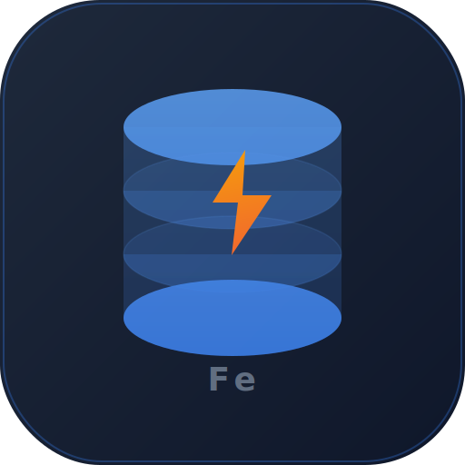
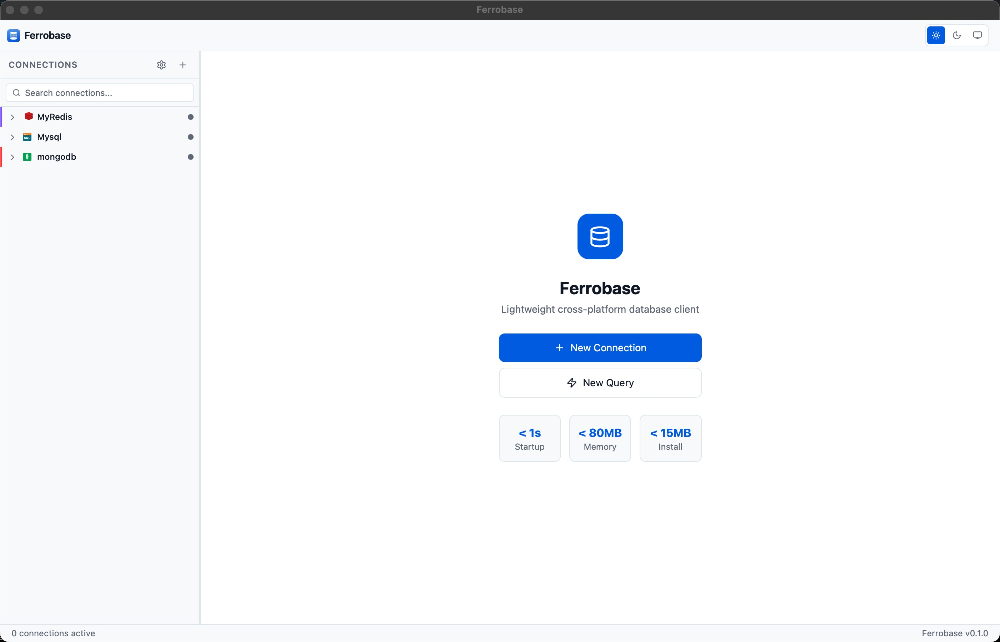
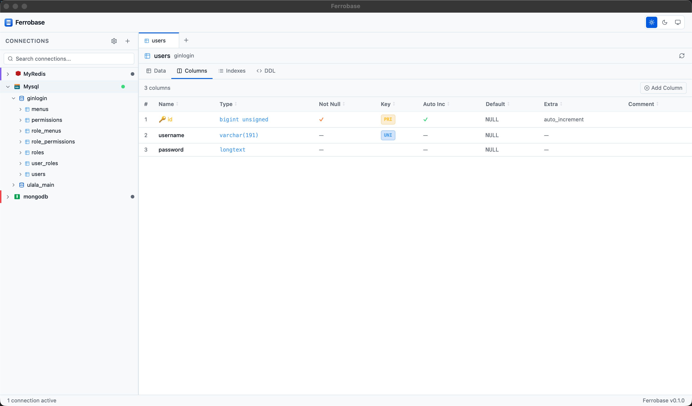
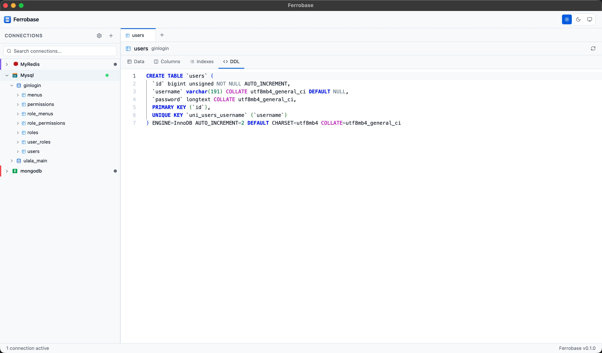
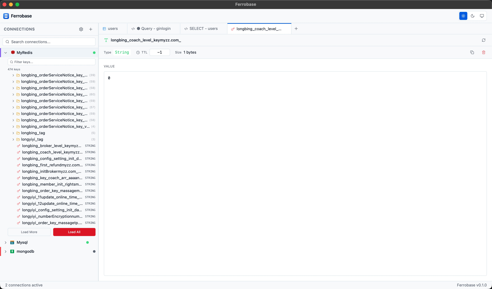
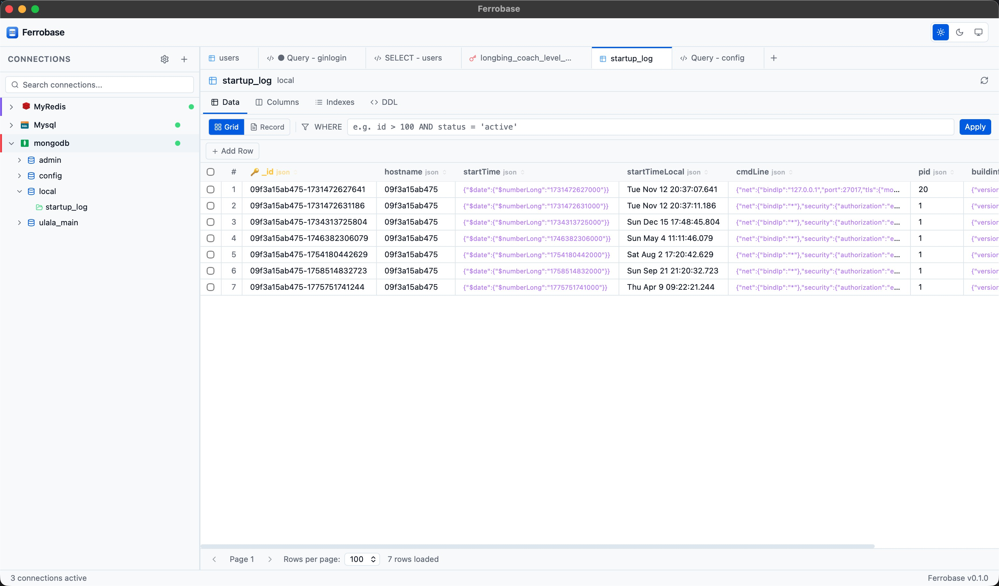
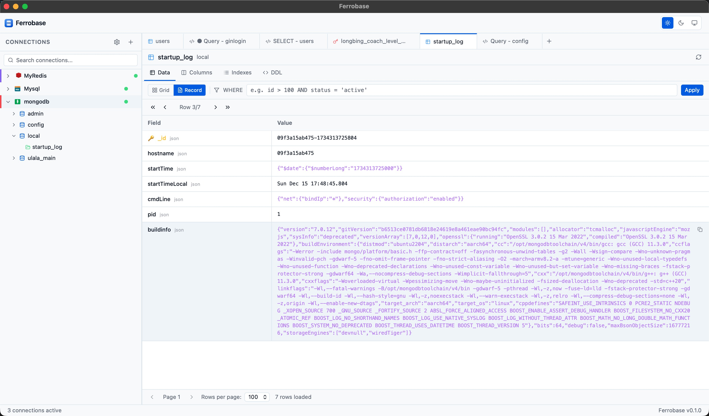
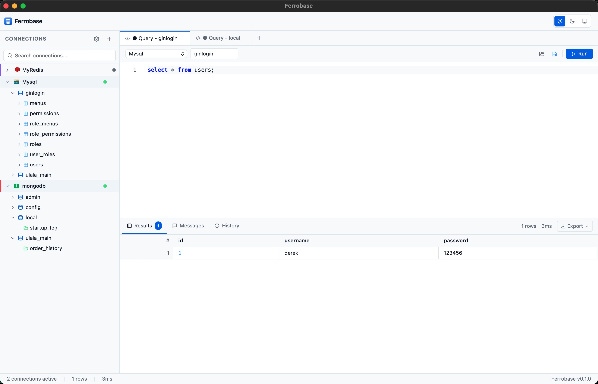

<p align="center">
  
</p>

<h1 align="center">Ferrobase</h1>

<p align="center">
  <strong>Lightweight Cross-Platform Database Client</strong>
</p>

<p align="center">
  
  
  
  
</p>

<p align="center">
  <a href="#english">English</a> · <a href="#中文">中文</a>
</p>

---

<a id="english"></a>

## English

### About

Ferrobase is a modern, lightweight, cross-platform database client built with **Rust + Tauri 2 + React + TypeScript**. It provides a fast, beautiful, and developer-friendly experience for managing multiple types of databases — all in a single app under 15MB.

### Features

- **Multi-Database Support** — MySQL, PostgreSQL, SQLite, MongoDB, Redis, SQL Server, ClickHouse
- **Smart SQL Editor** — Powered by Monaco Editor with context-aware autocomplete (keywords, functions, table names, column names), syntax highlighting, and format on demand
- **Redis Key Explorer** — Hierarchical key tree with `:` separator, folder collapsing, and a full key detail viewer for all Redis data types (String, Hash, List, Set, ZSet, Stream)
- **Data Grid** — Virtual-scrolling data grid with inline editing, sorting, filtering, and row operations
- **Tab Management** — Multi-tab interface with context menu (Close, Close Others, Close Left/Right, Close All)
- **Safety First** — Confirmation dialogs for all dangerous operations (DROP, TRUNCATE, DELETE without WHERE, etc.)
- **SSH Tunneling** — Connect to remote databases through SSH with password or private key authentication
- **Theme Support** — Light, Dark, and System theme modes
- **Cross-Platform** — Native performance on macOS, Windows, and Linux
- **Tiny Footprint** — Less than 1s startup, under 80MB memory, under 15MB install size

### Supported Databases

| Database | Status | Features |
|----------|--------|----------|
| MySQL | ✅ Ready | Query, Table View, Indexes, DDL, Data Editing |
| PostgreSQL | ✅ Ready | Query, Table View, Indexes, DDL, Data Editing |
| SQLite | ✅ Ready | Query, Table View, Indexes, DDL |
| Redis | ✅ Ready | Key Tree, Key Viewer (all types), TTL Management |
| MongoDB | 🚧 WIP | Connection, Basic Query |
| SQL Server | 🚧 WIP | Connection, Basic Query |
| ClickHouse | 🚧 WIP | Connection, Basic Query |

### Keyboard Shortcuts

| Action | macOS | Windows / Linux |
|--------|-------|-----------------|
| Execute Query | `⌘ + Enter` | `Ctrl + Enter` |
| Execute Selected SQL | `⌘ + Shift + Enter` | `Ctrl + Shift + Enter` |
| Format SQL | `⇧ + ⌥ + F` | `Shift + Alt + F` |
| Save SQL File | `⌘ + S` | `Ctrl + S` |
| New Tab | `⌘ + T` | `Ctrl + T` |
| Close Tab | `⌘ + W` | `Ctrl + W` |
| New Connection | `⌘ + N` | `Ctrl + N` |

### Tech Stack

- **Backend**: Rust + Tauri 2 + Tokio
- **Frontend**: React 18 + TypeScript
- **UI**: Tailwind CSS + Radix UI
- **Editor**: Monaco Editor (same engine as VS Code)
- **Tables**: TanStack Table + TanStack Virtual (virtualized for millions of rows)
- **State**: Zustand + Immer + TanStack Query
- **DB Drivers**: sqlx (MySQL/PG/SQLite), mongodb, redis-rs
- **Security**: OS Keychain for password storage (macOS Keychain / Windows DPAPI)

### Architecture

```
ferrobase/
├── src-tauri/          # Rust backend
│   ├── src/
│   │   ├── commands/   # Tauri IPC commands
│   │   ├── db/         # Database drivers (MySQL, PG, SQLite, MongoDB, Redis)
│   │   ├── models/     # Shared data types
│   │   └── pool/       # Connection pool registry
│   └── Cargo.toml
├── src/                # React frontend
│   ├── api/            # Tauri invoke wrappers
│   ├── components/     # UI components
│   │   ├── icons/      # SVG database icons
│   │   ├── QueryEditor/    # Monaco SQL editor + autocomplete
│   │   ├── TableView/      # Data grid with editing
│   │   ├── RedisViewer/    # Redis key detail viewer
│   │   ├── DatabaseTree/   # Sidebar tree (tables, Redis keys)
│   │   └── ConnectionPanel/# Connection dialog
│   ├── stores/         # Zustand state management
│   └── types/          # TypeScript types
└── package.json
```

### Getting Started

#### Prerequisites

- [Rust](https://www.rust-lang.org/tools/install) (1.70+ stable)
- [Node.js](https://nodejs.org/) (18+)
- [Tauri 2 Prerequisites](https://v2.tauri.app/start/prerequisites/)

#### Development

```bash
# Clone the repo
git clone https://github.com/derekzhan/Ferrobase.git
cd Ferrobase

# Install dependencies
npm install

# Start development server
npm run tauri dev
```

#### Build

```bash
# Build for production
npm run tauri build
```

The `.dmg` (macOS), `.msi` (Windows), or `.AppImage` (Linux) installer will be in `src-tauri/target/release/bundle/`.

#### macOS Notice

Current macOS releases are not code signed or notarized yet. On first launch, macOS may show a warning such as `"Ferrobase" is damaged and can't be opened`.

If you trust the downloaded app, move `Ferrobase.app` into `/Applications` and run:

```bash
xattr -dr com.apple.quarantine /Applications/Ferrobase.app
```

Then launch the app again.

### Screenshots

#### Main Workspace



#### Query Editor And Database Tree



#### Table Structure And Metadata



#### Data Grid Editing



#### Connection Management



#### Redis Viewer



#### Additional Workspace View



### Contributing

Contributions are welcome! Please feel free to submit a Pull Request.

### License

MIT License — see [LICENSE](LICENSE) for details.

---

<a id="中文"></a>

## 中文

### 简介

Ferrobase 是一款现代化、轻量级、跨平台的数据库客户端，基于 **Rust + Tauri 2 + React + TypeScript** 构建。目标是在一个不到 15MB 的应用中，提供快速、美观、对开发者友好的多数据库管理体验。

### 功能特性

- **多数据库支持** — MySQL、PostgreSQL、SQLite、MongoDB、Redis、SQL Server、ClickHouse
- **智能 SQL 编辑器** — 基于 Monaco Editor，支持上下文感知的自动补全（关键字、函数、表名、列名），语法高亮，一键格式化
- **Redis Key 浏览器** — 支持 `:` 分隔符的层级 Key 树展示，文件夹折叠，支持所有 Redis 数据类型（String、Hash、List、Set、ZSet、Stream）的详细查看与编辑
- **数据表格** — 虚拟滚动数据网格，支持行内编辑、排序、筛选和行操作
- **标签页管理** — 多标签页界面，右键菜单支持关闭、关闭其他、关闭左侧/右侧、关闭全部
- **安全优先** — 所有危险操作（DROP、TRUNCATE、无 WHERE 的 DELETE 等）均有二次确认弹窗
- **SSH 隧道** — 支持通过 SSH 密码或私钥认证连接远程数据库
- **主题切换** — 浅色、深色、跟随系统三种主题模式
- **跨平台** — macOS、Windows、Linux 原生性能
- **极致轻量** — 启动不到 1 秒，内存占用低于 80MB，安装包小于 15MB

### 支持的数据库

| 数据库 | 状态 | 功能 |
|--------|------|------|
| MySQL | ✅ 可用 | 查询、表视图、索引、DDL、数据编辑 |
| PostgreSQL | ✅ 可用 | 查询、表视图、索引、DDL、数据编辑 |
| SQLite | ✅ 可用 | 查询、表视图、索引、DDL |
| Redis | ✅ 可用 | Key 树、Key 查看器（所有类型）、TTL 管理 |
| MongoDB | 🚧 开发中 | 连接、基础查询 |
| SQL Server | 🚧 开发中 | 连接、基础查询 |
| ClickHouse | 🚧 开发中 | 连接、基础查询 |

### 快捷键

| 操作 | macOS | Windows / Linux |
|------|-------|-----------------|
| 执行查询 | `⌘ + Enter` | `Ctrl + Enter` |
| 执行选中 SQL | `⌘ + Shift + Enter` | `Ctrl + Shift + Enter` |
| 格式化 SQL | `⇧ + ⌥ + F` | `Shift + Alt + F` |
| 保存 SQL 文件 | `⌘ + S` | `Ctrl + S` |
| 新建标签页 | `⌘ + T` | `Ctrl + T` |
| 关闭标签页 | `⌘ + W` | `Ctrl + W` |
| 新建连接 | `⌘ + N` | `Ctrl + N` |

### 技术栈

- **后端**: Rust + Tauri 2 + Tokio
- **前端**: React 18 + TypeScript
- **UI**: Tailwind CSS + Radix UI
- **编辑器**: Monaco Editor（与 VS Code 相同引擎）
- **数据网格**: TanStack Table + TanStack Virtual（支持百万行虚拟滚动）
- **状态管理**: Zustand + Immer + TanStack Query
- **数据库驱动**: sqlx (MySQL/PG/SQLite)、mongodb、redis-rs
- **安全**: 操作系统钥匙串存储密码（macOS Keychain / Windows DPAPI）

### 项目结构

```
ferrobase/
├── src-tauri/          # Rust 后端
│   ├── src/
│   │   ├── commands/   # Tauri IPC 命令
│   │   ├── db/         # 数据库驱动 (MySQL, PG, SQLite, MongoDB, Redis)
│   │   ├── models/     # 共享数据类型
│   │   └── pool/       # 连接池管理
│   └── Cargo.toml
├── src/                # React 前端
│   ├── api/            # Tauri invoke 封装
│   ├── components/     # UI 组件
│   │   ├── icons/      # SVG 数据库图标
│   │   ├── QueryEditor/    # Monaco SQL 编辑器 + 自动补全
│   │   ├── TableView/      # 数据网格 + 编辑
│   │   ├── RedisViewer/    # Redis Key 详情查看器
│   │   ├── DatabaseTree/   # 侧边栏树（表、Redis Key）
│   │   └── ConnectionPanel/# 连接对话框
│   ├── stores/         # Zustand 状态管理
│   └── types/          # TypeScript 类型定义
└── package.json
```

### 快速开始

#### 环境要求

- [Rust](https://www.rust-lang.org/tools/install) (1.70+ 稳定版)
- [Node.js](https://nodejs.org/) (18+)
- [Tauri 2 环境依赖](https://v2.tauri.app/start/prerequisites/)

#### 开发

```bash
# 克隆仓库
git clone https://github.com/derekzhan/Ferrobase.git
cd Ferrobase

# 安装依赖
npm install

# 启动开发服务器
npm run tauri dev
```

#### 构建

```bash
# 构建生产版本
npm run tauri build
```

安装包位于 `src-tauri/target/release/bundle/` 目录下（macOS 为 `.dmg`，Windows 为 `.msi`，Linux 为 `.AppImage`）。

#### macOS 说明

当前发布的 macOS 安装包还没有做代码签名和 notarization。首次打开时，macOS 可能会提示 `"Ferrobase" is damaged and can't be opened`。

如果你确认安装包来源可信，请先将 `Ferrobase.app` 拖到 `/Applications`，然后执行：

```bash
xattr -dr com.apple.quarantine /Applications/Ferrobase.app
```

之后再重新打开应用。

### 截图

#### 主工作区


#### 查询编辑器与数据库树


#### 表结构与元数据


#### 数据表格编辑


#### 连接管理


#### Redis 查看器


#### 其他工作区视图


### 贡献

欢迎提交 Pull Request！

### 开源协议

MIT License — 详见 [LICENSE](LICENSE)。
